# LDPC 编解码仿真

## 前言

### 代码仓库引用

### 文档乱码问题

**本文档使用Typora软件编辑，Github由于无法解析部分语法可能会出现乱码，出现乱码请使用Typora打开即可。**

行间公式出现乱码时：Typora软件勾选 “插入内联公式” 选项，点击“文件” --> “偏好设置” --> “Markdown” --> “Markdown扩展语法” —> 勾选 “内联公式（例：$ \LaTeX $）”

另外提供了无乱码的pdf版文档。

### 仿真流程

仿真时无需输入额外参数，只需要把整个仓库clone到本地即可。

1. 首先运行SearchBestAlpha.m脚本得到误码率最低时的α取值；
2. 然后运行SearchBestBeta.m脚本得到误码率最低时的β值；
3. 把上面得到的α和β值在Comparisonof4Algorithms.m中确定下来，直接运行Comparisonof4Algorithms.m即可比较4种译码算法的误码率和误帧率曲线

### 仿真时间

4种解码算法的比较脚本运行时间较长，只有当四个译码算法的误帧数都到达指定数量时才会停止运行

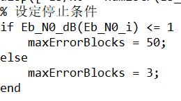

运行时长可能高达几个小时甚至几十个小时，运行后Matlab命令行窗口会每隔一定时间输出提示信息，建议可以晚上睡前运行脚本，睡醒可能就差不多跑完了。

如果想要早点结束可以设置Eb_N0_dB的值的范围到1或者1.5或更小的值。

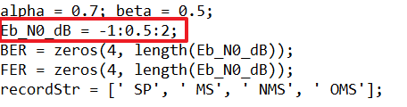

## 1. LDPC码背景及概要

LDPC是Low Density Parity Check Code英文缩写，意为低密度奇偶校验码，最早在20世纪60年代由Gallager在他的博士论文中提出，但限于当时的技术条件，缺乏可行的译码算法，此后的35年间基本上被人们忽略。直到1993年Berrou等人发现了Turbo码，在此基础上，1995年前后MacKay和Neal等人对LDPC码重新进行了研究，提出了可行的译码算法，从而进一步发现了LDPC码所具有的良好性能，迅速引起强烈反响和极大关注。经过十几年来的研究和发展，研究人员在各方面都取得了突破性的进展，LDPC码的相关技术也日趋成熟，逐渐有了商业化的应用成果，如今LDPC码已经作为众多新一代通信标准中的信道编码方案：DVB-S2 (Digital Video Broadcasting)、IEEE 802.3an (Ethernet)、IEEE 802.16e (WiMax)、IEEE 802.11n (WiFi)、3GPP 5G标准。

LDPC码是一种稀疏校验矩阵线性分组码，在LDPC编码中，会用到一个叫做H矩阵的校验矩阵(Parity Check Matrix)，该校验矩阵为稀疏矩阵。

LDPC编码分为正则编码和非正则编码。正则编码中，校验矩阵的每行和每列中1的个数是固定的。非正则编码中，校验矩阵的每行和每列中1的个数不固定。

LDPC解码过程中，主要包括了两方面内容：硬解码(Hard Decode)和软解码(Soft Decode). LDPC解码的方法就是收到码字之后，与校验矩阵H相乘，如果是0矩阵，则说明收到的是正确码字。反之，则不正确码字，再根据相乘结果进行进一步纠错解码

## 2. 仿真内容

本仿真通过MATLAB软件对LDPC码进行编译码仿真，通过计算模拟求解归一化最小和算法α参数的最佳值和偏置最小和算法β参数的最佳值，并仿真出四种不同的译码算法下的误码率和误帧率曲线。具体实验内容如下：

1. 采用系统码设计，信息序列长1008比特，码长2016比特，码率1/2，即

   $$
   N=2016,\ K=1008,\ R=1/2
   $$

2. 给定的编码矩阵 H_block 是一个18x36的矩阵（Matrix(2016,1008)Block56.mat文件中也是只有18x36个数据），矩阵中每个元素 H(i,j) 是大小为 z*z 的循环移位矩阵（给定z=56），行重为1，它的值表示该矩阵的循环位移偏移量，也是第一行中元素1所处的列的位置，若H(i,j)值为0，表示是全0矩阵。

3. 给定 $H\_block_{18×36}$ 矩阵，根据给定规则求解校验矩阵 $H_{1008, 2016}$ 。

4. 根据校验矩阵直接进行编码：利用输入信息比特序列$s$和校验矩阵$H$求得校验比特序列 $p$ ， $x = \lbrack p\ s\rbrack$ 即为编码序列。

5. 编码序列采用BPSK调制并通过AWGN信道添加噪声。

6. 完成以下四种译码算法的MATLAB代码实现

   1.  和积算法（Sum-Product, SP）

   2.  最小和算法（Min-Sum, MS）

   3.  归一化最小和算法(Normalized Min-Sum, NMS)

   4.  偏置最小和算法(Offset Min-Sum, OMS)

7. 对于归一化最小和算法和偏置最小和算法，选定一个Eb/N0（1dB附近），仿真BER得出α和β最佳值。α和β取值范围均为0到1，步进为0.1，α和β的BER曲线各画一张图。

8. 仿真得出Eb/N0在-1dB到2dB（步进0.5dB）时四种译码算法的BER和FER，两个修正最小和算法的α和β都取最佳值。应画BER一张图，FER一张图，每一张图都包含四种算法。

### 2.1. LDPC编码算法

LDPC码通常由校验矩阵H进行定义。尽管线性分组码可以使用传统的生成矩阵进行编码，但是要通过H求解G在实现上较为困难，因此根据校验矩阵直接进行编码。本实验采用系统码，且校验矩阵H可分为两部分$$
H=\left[ H_p|H_s \right] 
$$，其中$$
H_p
$$对应校验比特部分，对$$
H_s
$$应信息比特部分；编码序列x可分为$$
x=\left[ p\ s \right] 
$$，其中$p$为校验比特序列，$s$为信息比特序列。编码部分有两种编码算法用以实现LDPC编码。

#### 2.1.1. LDPC编码算法1

由于校验矩阵H的性质：

$$
Hx^T=0
$$
因此可采用基于H矩阵的通用LDPC编码方法：

$$
Hx^T=0\Rightarrow \left[ H_p,H_s \right] \left[ \begin{array}{c}
	p^T\\
	s^T\\
\end{array} \right] =0\Rightarrow p=sH_{s}^{T}\left( H_{p}^{T} \right) ^{-1}
$$
由上式可知，本算法需要$H_{p}$可逆，且上式p为1x(N-K)向量、s为1xK向量、$H_{s}^{T}$为Kx(N-K)矩阵、$H_{p}^{T}$为Kx(N-K)矩阵，因此该算法需要$K(N - K) + (N - K)(N - K)$次比特乘法运算和$(K - 1)(N - K) + (N - K - 1)(N - K)$次比特加法运算。

#### 2.1.2. LDPC编码算法2

将基于H矩阵的通用LDPC编码方法进行分解，具体步骤如下：

1)  首先利用信息序列s计算中间结果
$$
w=sH_{s}^{T}\quad w=\left[ w_1,w_2,\cdots ,w_{m_bz} \right]
$$

2)  利用编码序列x计算校验比特
$$
Hx^T=0\Rightarrow \left[ H_p,H_s \right] \left[ \begin{array}{c}
	p^T\\
	s^T\\
\end{array} \right] =0\Rightarrow pH_{p}^{T}=sH_{s}^{T}
$$
故可得：
$$
p_i=\left\{ \begin{matrix}
	w_i&		i=1&		\\
	w_i\oplus p_{\left( m_b-1 \right) z+i-1}&		1<i\leq z&		p=\left[ p_1,p_2,\cdots ,p_{m_bz} \right]\\
	w_i\oplus p_{i-z}&		i>z&		\\
\end{matrix} \right. 
$$

此算法易错处为：
上式中运算过程是应由右侧值决定左侧值，即只有当右侧表达式中各变量的值被赋过一次值时才能对左侧值赋值。例如：

- 当i=1时，w1已知，p1=w1
- 当i=2时，w2已知，但p(mb-1)\*z并没有值，因此此时还不能立刻求p2，而是应该求p(z+1)=w(z+1) 模二求和 p(1)。即：
  -当i=(z+1)时，w(z+1)已知，p(1)已知，p(z+1)=w(z+1) 模二求和 p(1)
- ...

3)  组合p与s

$$
x=\left[ p\ s \right]
$$
将校验比特序列p和信息比特序列s组合即得到编码序列x。

4)  检验
由于编码过程利用的是

$$
Hx^T=0
$$

因此，得到编码序列x后需要对x进行检验，保证其满足上式即表明完成了正确编码工作。

#### 2.1.3. 两种算法比较

两种算法在时间复杂度上的区别如图所示（$\left( H_{p}^{T} \right)^{- 1}$可以离线求解，所以不占用复杂度）， 两种编码算法的时间复杂度对比

算法1适用于$H_{p}^{T}$可逆的通用H矩阵，而算法2适用于本次仿特定的H矩阵。由时间复杂度的比较，本次仿真采用时间复杂度低的算法2。

### 2.2. 调制过信道

本次仿真采用实数BPSK调制并AWGN信道下进行误码率和误帧率的性能仿真。

#### 2.2.1. BPSK

实数BPSK调制即将比特0映射为符号1，比特1映射为符号-1，变换式为：

$$
d = 1-2x
$$
其中d为BPSK调制后的符号（序列），x为编码比特（序列）。

在实数BPSK中，信噪比SNR和Eb/N0的转换关系为：

$$
(S N R)_{d B}=\left(\frac{E_{b}}{N_{0}}\right)_{d B}+10 \log _{10}(R)-10 \log _{10}\left(\frac{1}{2}\right), R=\frac{K}{N}
$$

#### 2.2.2. AWGN

BPSK调制后的信号通过AWGN信道将会对信号添加噪声，matlab中给信号添加AWGN噪声方式为：

$$
y=d+n
$$
其中，d为BPSK调制后的符号（序列），n为噪声信号（序列），y为通过AWGN信道后的信号值（序列）。噪声n在matlab中表示为：

$$
n = \ \sigma*randn(row,\ col)
$$
其中$\sigma^{2}$为噪声功率，计算方法为：

$$
\sigma^{2} = \frac{1}{(SNR)_{\text{linear}}}
$$

#### 2.2.3. 初始置信度

信息序列经过编码、BPSK调制，在AWGN信道下接收信号y的对数似然比（LLR，或初始置信度）为：

$$
LLR(y) = \ln\frac{p(y|x = 0)}{p(y|x = 1)} = \ln\frac{\frac{1}{\sqrt{2\pi\sigma^{2}}}e^{- \frac{(y - 1)^{2}}{2\sigma^{2}}}}{\frac{1}{\sqrt{2\pi\sigma^{2}}}e^{- \frac{(y + 1)^{2}}{2\sigma^{2}}}} = \frac{2}{\sigma^{2}}y
$$
其中，

$$
\sigma^{2} = \frac{1}{(SNR)_{\text{linear}}}
$$

### 2.3. LDPC解码算法

本仿真实验采用四种译码算法，分别为：

1.  和积算法（Sum-Product, SP）

2.  最小和算法（Min-Sum, MS）

3.  归一化最小和算法(Normalized Min-Sum, NMS)

4.  偏置最小和算法(Offset Min-Sum, OMS)

#### 2.3.1. 和积算法（SP）

算法流程为：

**第一步：初始化**

每个比特从信道中接收到的信道信息作为初始置信度，也即变量节点的置信度，其中表示第i个比特从信道接收到的LLR。和积算法初始化步骤的二分图为：

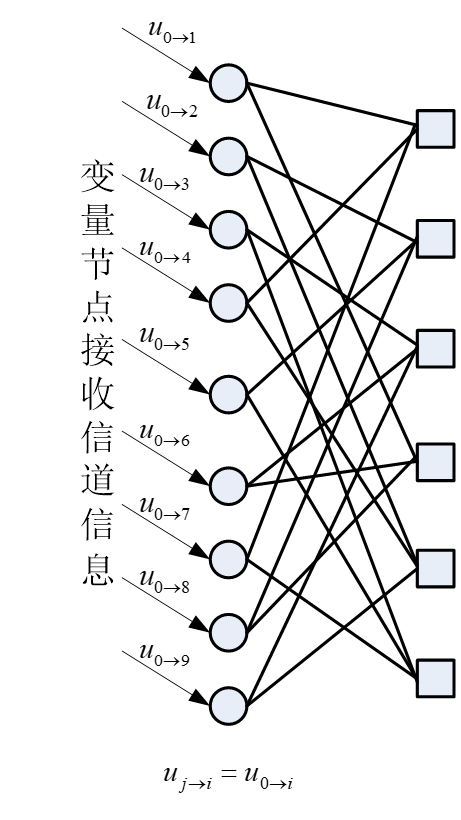

**置信度传递**

1)  每个变量节点要将自己的置信度传递给具有校验关系的校验节点。第i个变量节点传递给第j个校验节点的置信度计算方法

$$
v_{i \rightarrow j}=u_{0 \rightarrow i}+\sum_{k=1, k \neq j}^{d_{i}^{v}} u_{k \rightarrow i}
$$
其中$d_{i}^{v}$表示第i个变量节点的度。和积算法变量节点传递置信度给校验节点步骤的二分图为：

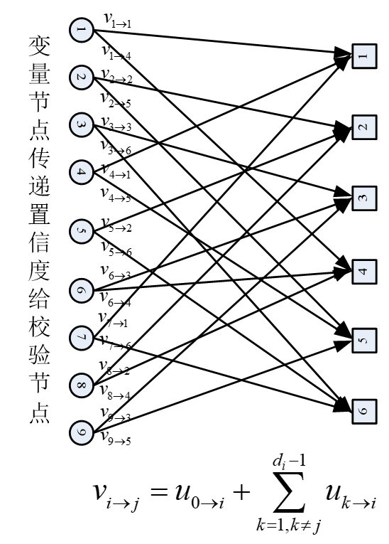

2)  校验节点根据变量节点传递来的置信度，更新每一个变量节点的置信度。第j个校验节点为第i个变量节点更新的置信度为

$$
u_{j \rightarrow i}=2 \tanh ^{-1}\left(\prod_{k=1, k \neq i}^{d_{j}^{c}} \tanh \left(\frac{v_{k \rightarrow j}}{2}\right)\right)
$$

其中$d_{j}^{c}$表示第j个校验节点的度。和积算法校验节点传递置信度给变量节点步骤的二分图为：

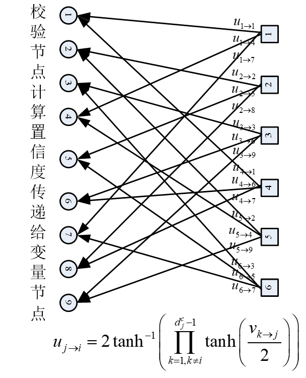

**判决**

1)  置信度更新完毕后做硬判决
$$
\hat{x}_{i}=\left\{\begin{array}{lll}
1 & \text { if } & \sum_{k=0}^{d_{i}^{v}} u_{k \rightarrow i}<0 \\
0 & \text { if } & \sum_{k=0}^{d_{i}^{v}} u_{k \rightarrow i} \geq 0
\end{array}\right.
$$
2)  如果所有的校验关系得到满足，即$H{\widehat{x}}^{T} = 0$，其中$\widehat{x} = \left( {\widehat{x}}_{1},{\widehat{x}}_{2},\cdots,{\widehat{x}}_{N} \right)$，则译码结束，取出$\widehat{s} = \left( {\widehat{x}}_{N - K + 1},{\widehat{x}}_{N - K + 2},\cdots,{\widehat{x}}_{N} \right)$即为信息位s的估计；如果不成立，则返回迭代的第二步继续迭代，直至达到迭代次数的上限。

#### 2.3.2. 最小和算法（MS）

因为和积运算的积运算部分需要进行的反双曲正切连乘等非常复杂的运算，在硬件实现中通常只能利用查表等相对繁琐的操作来完成，因此需要进行改进。最小和算法与和积算法大同小异，区别在于积算法不再用

$$
u_{j \rightarrow i} = 2{\tan h}^{- 1}\left( \prod_{k = 1,k \neq i}^{d_{j}^{c}}{{\tan h}\left( \frac{v_{k \rightarrow j}}{2} \right)} \right)
$$
而是用

$$
u_{j \rightarrow i} = \left( \prod_{k = 1,k \neq i}^{d_{j}^{c}}{\text{sign}\left( v_{k \rightarrow j} \right)} \right)\left( \min_{k \in \{ 1,2\cdots d_{j}^{c}\}\backslash i}(\left| v_{k \rightarrow j} \right|) \right)
$$

#### 2.3.3. 归一化最小和算法（NMS）

归一化最小和算法建立在最小和算法之上，在计算校验节点为变量节点更新的置信度时引入归一化系数α，以减小Min-Sum译码消息的幅度

$$
u_{j \rightarrow i} = \left( \prod_{k = 1,k \neq i}^{d_{j}^{c}}{\text{sign}\left( v_{k \rightarrow j} \right)} \right)\left( \min_{k \in \{ 1,2\cdots d_{j}^{c}\}\backslash i}(\left| v_{k \rightarrow j} \right|) \right)*\alpha
$$
α的取值在0到1之间，这种算法中通过引入α减小了译码消息的幅度，取值合适时性能逼近和积算法（为了简化要求，α取值精确到小数点后一位即可）。

#### 2.3.4. 偏置最小和算法（OMS）

偏置最小和算法也是建立在最小和算法之上，在计算校验节点为变量节点更新的置信度时引入偏置量β

$$
u_{j \rightarrow i} = \left( \prod_{k = 1,k \neq i}^{d_{j}^{c}}{\text{sign}\left( v_{k \rightarrow j} \right)} \right)\left( max\lbrack\min_{k \in \{ 1,2\cdots d_{j}^{c}\}\backslash i}(\left| v_{k \rightarrow j} \right|) - \beta,0\rbrack \right)
$$
$\min_{k \in \{ 1,2\cdots d_{j}^{c}\}\backslash i}(\left| v_{k \rightarrow j} \right|)$ 小于β时，我们将其置为零，也就是消除了其对于下一步信息节点更新中的贡献。β的取值在0到1之间，这种算法使得过小的校验信息不再传递到变量节点中，取值合适时性能逼近和积算法。

## 3. 仿真流程与结果分析

用MATLAB平台搭建一个简单的仿真系统，验证LDPC编解码的性能。

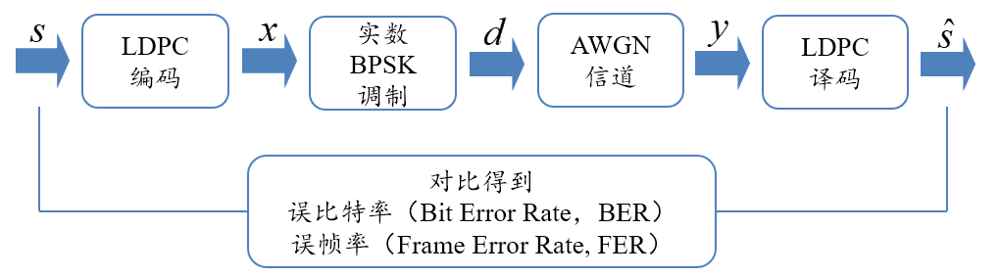

在本仿真中，首先在Eb/N0为1dB附近时根据BER求出最佳α和β取值；接下来，在2个修正最小和算法中使用最佳的α和β取值，绘制Eb/N0在-1dB到2dB（步进0.5dB）时四种译码算法的BER和FER。

在项目中，编码和解码算法分别位于"Encoder"和"Decoder"中，求解最佳α和β取值的主程序及四种算法性能比较的主程序位于" LDPC_Simulation"文件夹中，下表格说明了各程序功能。

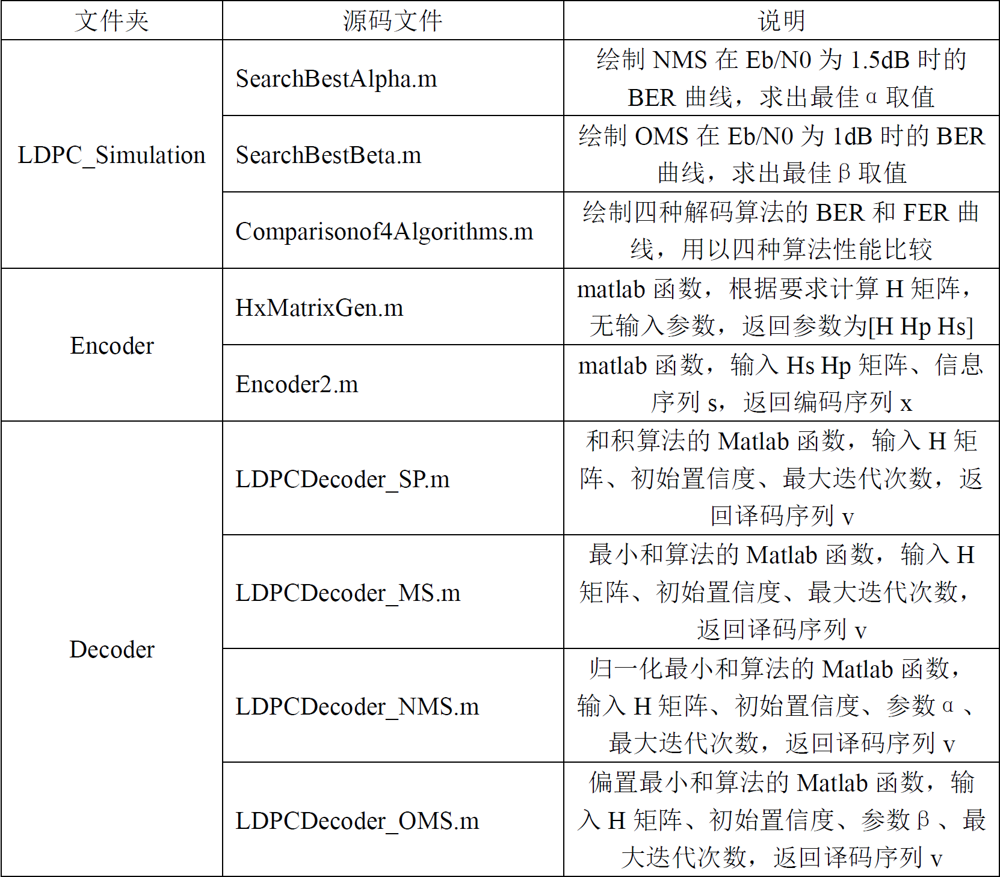

----------------------------------------------------------------------------------------------------------------------------------------

### 3.1. 求出2个修正最小和算法的最佳α和β取值

#### 3.1.1. NMS算法求取最佳α的BER曲线

使用matlab运行SearchBestAlpha.m代码，得到BER随α的变化曲线，如图所示。

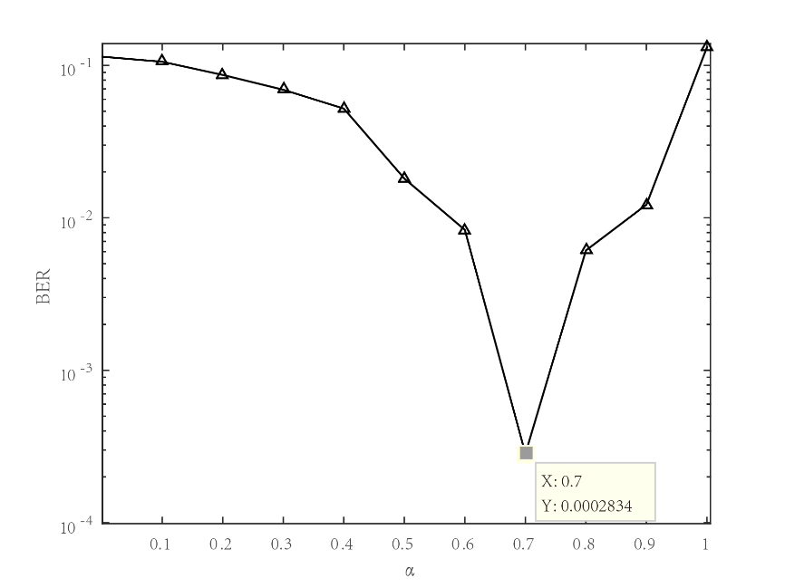

由上图可知，当α为0.7时NMS算法的BER性能最佳，因此NMS算法最佳的α为0.7。

#### 3.1.2. OMS算法求取最佳β的BER曲线

使用matlab运行SearchBestBeta.m代码，得到BER随β的变化曲线，如图所示。

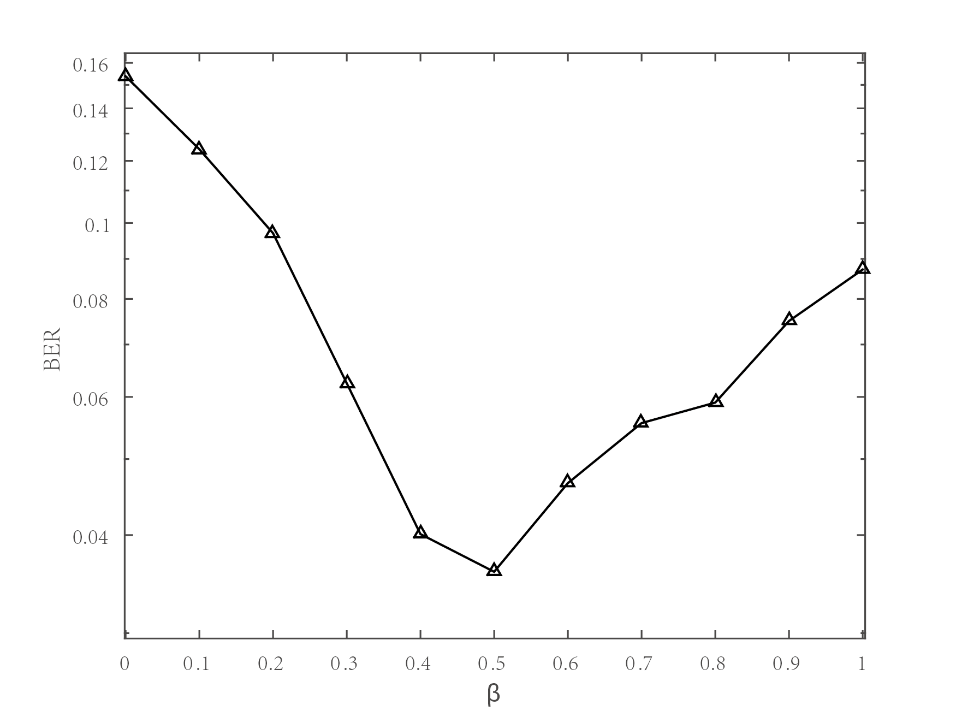

由上图可知，当β为0.5时OMS算法的BER性能最佳，因此OMS算法最佳的β值为0.5。

### 3.2. Eb/N0变化时四种算法的BER和FER

在2个修正最小和算法中使用最佳的α和β取值，即α=0.7，β=0.5，运行Comparisonof4Algorithms.m代码，可得到BER随Eb/N0的变化曲线如下图所示。

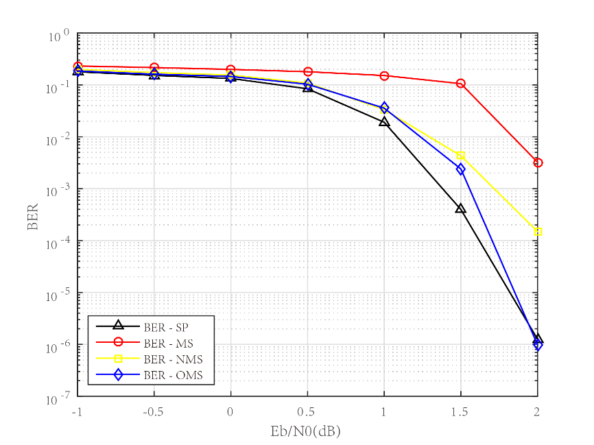

FER随Eb/N0的变化曲线如下图所示。

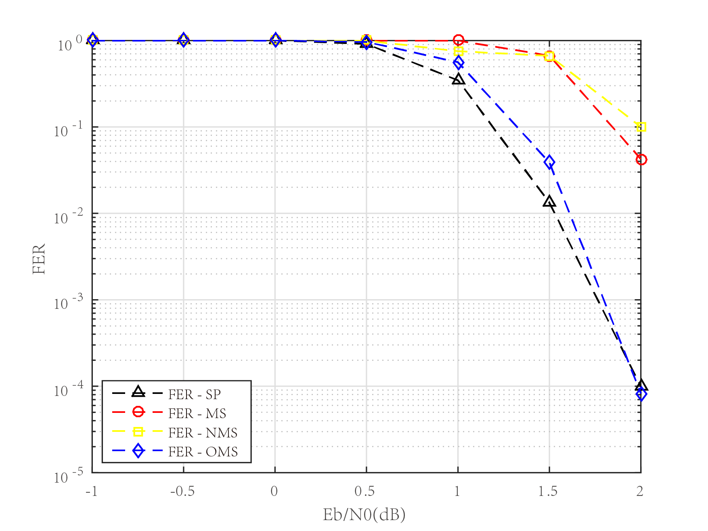

## 4. 结语

由于项目完成时间有限，本项目所实现的LDPC编译码算法仍有不完善甚至错误之处，如您发现算法实现有问题请联系我（htwuofuestcauto@163.com），谢谢！